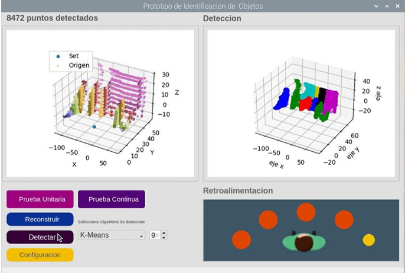
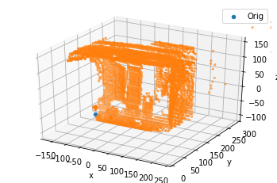
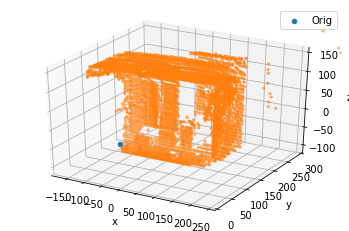
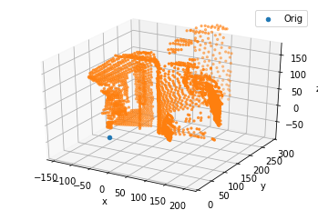
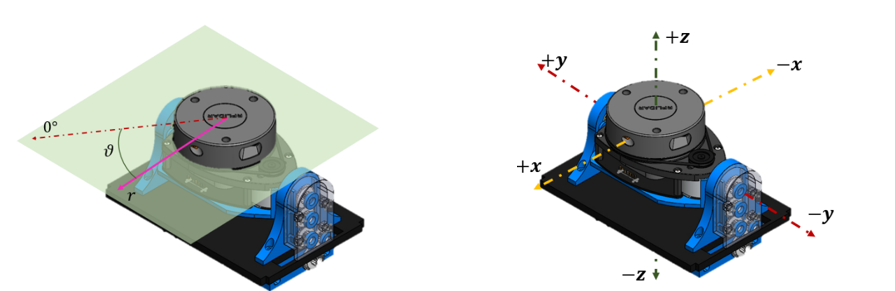

# Object detection for autonomous movement

# Contenido

* [Introducción](#intro)
* [Interface](#interface)
* [Lectura de Sets](#sets)
* [Generacion de Nuevos Sets](#nuevosSets)

## Introduction <a id='intro'></a>
This project was developed with the purpose of creating an obstacle detection system to assist individuals with motor disabilities.

The system consists of 3 stages, the first involving the acquisition of distance data from objects using the __[RP LiDAR A1](https://uelectronics.com/producto/rplidar-a1m8-r6-escaner-laser-360/)__  sensor and a rotation mechanism driven by a servo motor. The second stage involves the detection of these objects using clustering algorithms, and finally, the last stage involves providing feedback to the user, in this case, a person with visual disabilities, through vibration sensors.

Key Words: Computer Vision, Raspberry Pi, LiDAR, Machine Learning, Displacement due to disability_

## Interface <a id='interface'></a>

To run the system, you will need an RPLiDAR model A1-A2 sensor connected via USB 2.0 or, alternatively, a serial connection. You should execute the file GUI/main.py to open the interface.

In the interface, you can generate the space reconstruction in a unitary or continuous manner, as well as object detection using k-means and DBSCAN algorithms, or a combination of both.

Within the system's configuration, you can adjust the sensor's mapping range concerning the frontal plane in degrees as indicated by polar coordinates. Additionally, you can set the height of the subject to establish a reference for the system to the ground.
Libraires: _PyQt5, matplotlib, rplidar, numpy, scikit-learn_



It's important to note that when making the connection through the serial port or USB, you should verify the port where the connection is being established or, alternatively, where the connection is stored, as the Raspberry Pi configures this automatically.

* USB Conection: _rplidar.RPLidar("/dev/ttyUSB1")_

* Serial Port Conection: _rplidar.RPLidar("COM4")_

Another important thing to concider is the servo motor port. For this proyect, port 12 is used by default, due to his PWM output. If it's necessary use another port, this output can be modified in  _LidarTT/Servo.py_ class. 


## Data Sets lecture <a id='sets'></a>
Other util files the proyect includes, is  the execution file for sets  _Plotear_Sets.pyw_, When executed, it allows for the reconstruction and sectioning of points from any of the test sets located in the _/Sets_ folder. 

Likewise, below is the routine to be able to incorporate into new python file either using txt or csv.

### Data set lecture from *.txt file
It is posibble add the txt file path as a parameter. If you dont have the filepath and the function is left without arguments, A window will apear to search for the file to open.

```python
#  Function without arguments (A window will apear to look for the file)
import LibraryTT.txt2array as conversion
from  numpy import shape
%matplotlib inline
a=conversion.txt2array()
print(f"Forma del vector nx3 ={shape(a)}")
conversion.imprimir3D(a)
```

    Forma del vector nx3 =(3155, 3)
    


    

    


```python
# Forma 2: Function with arguments
%matplotlib inline
a=conversion.txt2array("./Sets/prueba_200911021124.txt")
conversion.imprimir3D(a)
```


    

    


### Data set lecture from *.csv file
La ventaja de manejar los archivos csv es que estos pueden ser manipulados en una hoja de calculo, en caso de ser necesario

De la misma forma, si la función de lecutra no tiene ningun argumento, se abrirá una ventana emergente para buscar el archivo *.csv que deseé abrir

```python
#Forma 1:   Funcion sin ningun argumento (Se abrirá ventana para buscar el archivo)
from  numpy import shape
%matplotlib inline
a=conversion.csv2array()
print(f"Forma del vector nx3 ={shape(a)}")
conversion.imprimir3D(a)
```

    Forma del vector nx3 =(3144, 3)
    


    

    


```python
# Forma 2: Función con algun argumneto
%matplotlib inline
a=conversion.csv2array("./Sets_CSV/prueba_200911015330.csv")
conversion.imprimir3D(a)
```


    

    


### Data set writting from *.txt file
Los archivos se guardarán con la siguiente nomenclatura:
    prueba<año><mes><dia><hora><minutos><segundos>.txt
    Ejemplo: "prueba_200911190321.txt"

```python
import os
a=conversion.txt2array()
conversion.array2txt(a) #Escritura del nuevo vector nx3
file = os.listdir("./Sets")
file.sort()
print("Archivo creado:" +file[-1]) #Imprime el ultimo elemento de la lista
```

    Archivo creado:prueba_200911190321.txt
    

### Data set writting from *.csv file
Los archivos se guardarán con la siguiente nomenclatura:
    prueba<año><mes><dia><hora><minutos><segundos>.csv
    Ejemplo: "prueba_200911190503.csv"

```python
import os
a=conversion.txt2array()
conversion.array2csv(a) #Escritura del nuevo vector nx3
file = os.listdir("./Sets_CSV")
file.sort()
print("Archivo creado:" +file[-1]) #Imprime el ultimo elemento de la lista
```

    Archivo creado:prueba_200911190503.csv
    

### Point cloud plot with 3D pyplot 
La librería ofrece además una función para poder imprimir los sets guardados de forma rápida

```python
%matplotlib inline
a=conversion.txt2array()
conversion.imprimir3D(a) # Hay que meter un array de forma nx3 corespondiente los sets de puntos LiDAR
```


    

    


## New sets generation <a id='nuevosSets'></a> 

Within the _LibraryTT/Lidar3D.py_ library, when you execute this script, you can perform the plane reconstruction for the generation of test sets, in case it is needed for training data with other methods.

This class will begin moving the servo motorized system along the *θ* axis. Once the motor stops, the file will be deposited in the same folder as the script.


